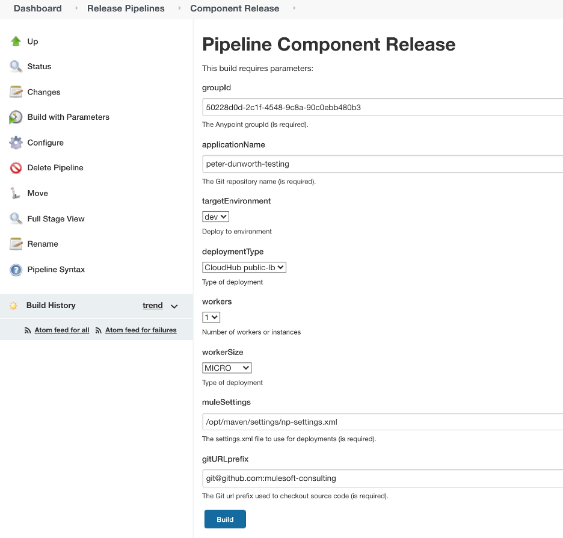
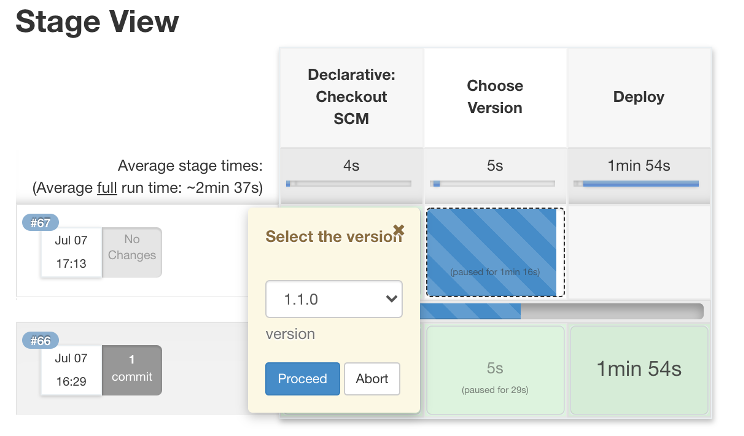

# A Component Release Pipeline

An example of a component release pipeline can be found here. It is a very generic pipeline that allows the deployment of a single component. To create a component release pipeline:

1.	Copy the component.release pipeline file and place it into a Git repository holding your pipeline scripts.
2.	Create a “Pipeline” item under the Jenkins folder that contains the component release pipelines and give it a suitable name.
3.	Configure the pipeline item as an SCM pipeline in Git specifying the Git repository name from step 1 and the pipeline script name.
4.	Select “This project is parameterized” and click “Save”.
5.	The component release pipeline should appear in the Jenkins folder and when you click on the pipeline name, you should see a “Build Now” in the left hand menu. Click the “Build Now” to run the pipeline for the first time..it should fail as it was not run with any parameters.
6.	Reload the Jenkins folder names and click on the pipeline name again, you should see the “Build Now” replaced with “Build with Parameters”.

## What to deploy is configured when the “Build with Parameters” is selected? 

When selected, the parameters that can be specified are shown in a dialog that looks like this:

Note that this is more parameters than are normally implemented, for instance, the groupId is usually the same across an organization. So you may consider re-working the pipeline to reduce the number of parameters that can be selected. 

When the build is triggered (click the Build button at the bottom), the Git repository is searched for the version tags published by the Developer Pipeline (release branch). The five most recent versions will be displayed for one to be chosen. The choice will be shown in a pop-up window when the browser cursor hovers over the “Choose Version” phase. It looks like this:

Once selected, that version (exactly as shown in the drop-down) will be retrieved from the artifact repository and deployed to the specified Mule runtime environment. There are plug-ins available for different artifact repositories that allow the version of an artifact to be chosen from the artifact repository instead of from Git. You may wish to change to one of these plugins instead of using the Git tags.

There are many variants of the component release pipeline. This example uses functions to perform the deployments, separating the user interface logic from the deployment logic. This makes it much easier to customize the user interface.

